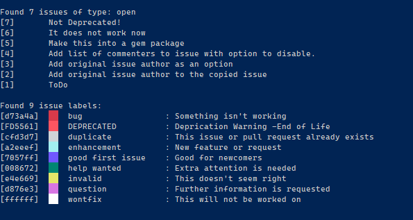
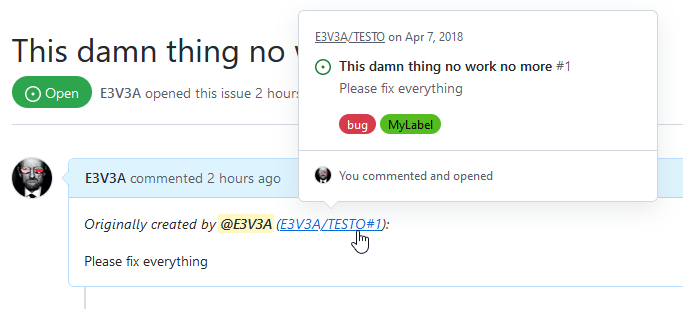
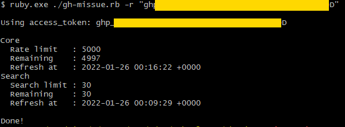

### gh-missue -- Migrate Like a Boss!

[](https://badge.fury.io/rb/missue "Last Uploaded Gem Version")
[](https://github.com/E3V3A/gh-missue "Last commit time/day")
[](https://GitHub.com/E3V3A/gh-missue/graphs/commit-activity "Is this repo maintained?")
[](http://isitmaintained.com//project/E3V3A/gh-missue "Average time to resolve an issue")


A complete GitHub issue migration CLI tool written in Ruby.


---

**Q:** *What does `gh-missue` do?*

The primary use is for migrating selected issues from any one repository to another.
But it can do much more. You can also:

- Migrate *issues*, their labels and their comments in correct order.
- `WIP` Migrate originally *closed* issues as *closed* **or** *opened*.
- List any/all issues in any puplic repository
- List or migrate only issues selected by their *status*: `[all, open, closed]`
- List all available issue *labels* for any repository
- Copy all available issue *labels* for any repository, including: `name, color, description`.
- Use 2 different types of GitHub authentication: (*none, OAuth2 token*)  
  (The GitHub Authentication API has discontinued allowing the use of *username/password*.)
- Test your current GitHub request status showing your: *rate limit, remaining requests, quota refresh time*.
- Test your authentication token


**Q:** *What does it **not** do?*

- Does not close issues on source repository after move
- Does not copy time-stamps. The new time is when the issue was moved.
- Does not copy issue-author. You will be the new author of all moved issues.
- Does not copy comment-authors. You will be the new author of all moved issue comments.
- Does not copy PR's. (But script can be easily modified to do so.)
- Does not replace the highly useful GitHub CLI tools [`gh`]() and [`hub`]().


**Q:** *Why is this needed?*

Sometimes, the structure of your project changes so drastically that it would break your repository.
You need an easy way to start from scratch and just commit everything to a new repository.
But, you've got all these valuable issues in the old repository on Github. Unfortunately, the new `gh` 
tool only copies (*transfer*) one issue at the time, and with no additional control. 

For any GitHub CLI usage, it is highly recommended to also install either [`gh`](https://cli.github.com/) or [`hub`](https://hub.github.com/).
Both these tools allow you to do native GitHub Pull Requests.

<details>
<summary>ClickMe! How to do a PR from CLI</summary>

There are 3 different ways to issue a native GitHub PR, depending on `gh` or `hub`.

* Using the `curl` with the [API](https://docs.github.com/en/rest/reference/pulls#create-a-pull-request)
* Using [gh](https://cli.github.com/manual/gh_pr_create)
* Using [hub](https://hub.github.com/hub-pull-request.1.html)


```bash
#------------------------------------------------
# Using 'curl'
#------------------------------------------------
curl -X POST -H "Accept: application/vnd.github.v3+json" \
  https://api.github.com/repos/octocat/hello-world/pulls \
  -d '{"head":"head","base":"base"}'

#------------------------------------------------
# Using 'gh' CLI
#------------------------------------------------

# Doing a simple PR using gh: 
gh pr create --title "Pull request title" --body "Pull request body"

# To autofill the title and body of a pull request from your commits:
gh pr create --fill

# To specify branches
# where: 
#   -B, --base <branch>     : The branch into which you want your code merged
#   -H, --head <branch>     : The branch that contains commits for your pull request (default: current branch)
gh pr create --base develop --head monalisa:feature

#------------------------------------------------
# Using 'hub' CLI
#------------------------------------------------
# open a pull request for the branch you've just pushed
hub pull-request

# open a pull request with title & body from a file
hub pull-request --copy -F prepared-message.md
```

</details>


**Q:** *Why are you using Ruby?*

I have never used Ryby until a few evenings ago. I came across an old library to migrate issues on github. 
However, it was half broken and extremely limited. But using a library sucked and I wanted a proper CLI 
that could handle large request rates. I decided to hack into it. Ruby is a nice and suprisingly robust 
language and it is still alive. Not surprsingly it is used by GitHub themselves.

You can read more about `Why Ruby isn't dead`: [here](https://www.engineyard.com/blog/ruby-still-isnt-dead) and 
[here](https://expertise.jetruby.com/is-ruby-on-rails-dead-2018-edition-407a618dab3a) and 
[here](https://www.tiobe.com/tiobe-index/ruby/).


**Q:** *Will I continue to support this tool?*

Sure, if it is broken, but I will not spend any more time for new features. So if you wanna add something 
please send me a PR.

---

#### Screenshots! 

  
<sub>(FFS always include a screenshot in your GitHub repo!)</sub>
 
  



---

### Dependencies

This tool depends on:

1. [docopt](https://github.com/docopt/docopt.rb/)  -- For amazingly cool command line option handling
2. [octokit](https://github.com/octokit/octokit.rb/) -- For GitHub API access


### Installation 

**Automatic** install:

We are now in the public repo, under [`missue`](https://rubygems.org/gems/missue).

`gem install missue`


**Manual** install:

1. To make this run, you need to:  
   (a) Have Ruby installed.  
       You can Manually install the `WITHOUT DEVKIT` version of Ruby from [here](https://rubyinstaller.org/downloads/), or use:  
       `winget install ruby`  
   (b) `gem install octokit`  
   (c) `gem install docopt`  
   (d) Clone this repo:  
       `git clone https://github.com/E3V3A/gh-missue.git`

2. You also **have to** create a personal authentication token for your GitHub
   account. This is needed to be able to push the new issues and labels into 
   your own repos. It also avoid you getting rate-limited by a large number 
   of requests in short time. Learn how to do this [here](https://docs.github.com/en/authentication/keeping-your-account-and-data-secure/creating-a-personal-access-token).

3. Run and test the app with:  

```Ruby
# check version:
ruby.exe -v

# List the current open issues (and labels) for this repo:
ruby.exe .\missue.rb -l open "YOUR_40_CHAR_OATH2_TOKEN" "E3V3A/gh-missue"

# Same as above, but with some more Warnings & Debug output:
ruby.exe -W2 .\missue.rb -d -l open "YOUR_40_CHAR_OATH2_TOKEN" "E3V3A/gh-missue"

# Check your current gitHub API Rate Limits:
ruby.exe .\missue.rb -r "YOUR_40_CHAR_OATH2_TOKEN"
```

### Usage

<details>
<summary>Click To See Usage!</summary>

```
$ ruby.exe .\bin\missue.rb -h

Description:

    gh-missue is a Ruby program that bulk migrate issues from one github repository to another.
    Please note that you can only migrate issues to your own repo, unless you have an OAuth2
    authentication token. You can also list all the open or closed issues and PR's along with
    the colored labels. It also include the original author's name and URL of the issues copied.

  Usage:
        missue.rb [-c | -n <ilist> | -t <itype>] <source_repo> <target_repo>
        missue.rb [-c | -n <ilist> | -t <itype>] <oauth2_token> <source_repo> <target_repo>
        missue.rb [-c | -n <ilist> | -t <itype>] <username> <password> <source_repo> <target_repo>
        missue.rb [-d] -l <itype> [<oauth2_token>] <repo>
        missue.rb -n <ilist>
        missue.rb -t <itype>
        missue.rb [-d] -r [<oauth2_token>]
        missue.rb -d
        missue.rb -v
        missue.rb -h

  Options:

        -c                  - only copy all issue labels from <source> to <target> repos, including name, color and description
        -l <itype> <repo>   - list available issues of type <itype> (all,open,closed) and all labels in repository <repo>
        -t <itype>          - specify what type (all,open,closed) of issues to migrate. [default: open]
        -r                  - show current rate limit and authentication method for your IP
        -d                  - show debug info with full option list, raw requests & responses etc.
        -n <ilist>          - only migrate issues with comma separated numbers given by the list. Can include a range.
        -h, --help          - show this help message and exit
        -v, --version       - show version and exit

  Examples:

        missue.rb -r
        missue.rb -l open E3V3A/gh-missue
        missue.rb -t closed "E3V3A/TESTO" "USERNAME/REPO"
        missue.rb -n 1,4-5 "E3V3A/TESTO" "USERNAME/REPO"

  Dependencies:
        missue.rb depends on the following gem packages: octokit, docopt.

  Bugs or Issues?
        Please report bugs or issues here:
        https://github.com/E3V3A/gh-missue

```

</details>


---

### How to Run

There are several ways to run this tool. Please refer to the built-in help for details. 
To show help, use the command option `-h`,  like this: `./gh-missue.rb -h`.

To copy all the **open** issues from one repository (`<source_repo>`) to another (`<target_repo>`):

1. If you want your issues to also copy the issue labels and including the `name, color, description` tags,  
   you have to make sure the target repo does not already have any issue labels. If it does,  
   you need to remove them first, using the github web page under *labels* settings.
2. First copy **all** the issue labels with:  
   `./gh-missue.rb -c <source_repo> <target_repo>`
3. Then copy all the *open* issues with:  
   `./gh-missue.rb -t open <source_repo> <target_repo>`


* If you omit creating all labels, the individual issue labels used, will still be created, but without color or description.
* If you hit a rate limit, you will need to insert your [personal access token](https://github.com/settings/tokens), before `<source_repo>`.  
You can check your current rate limit with: `./gh-missue.rb -r`


---

#### Bugs and Warnings

* :red_circle: If you need to copy more than 30 issues/hour, you will need to create a personal access token.  
  (Because the unauthenticated request limit is 60, and each copy operation need 2 requests.)

* If you are only migrating *labels* (with the `-c` option), make sure the labels doesn't already exist
in the target repo, or you will have a failure. I.e. there are some default labels, that you need
to remove from your target repo!

* :information_source: For other bugs, issues, details and updates, please refer to the
[issue tracker](https://github.com/E3V3A/gh-missue/issues).


#### Contribution

Feel free to post issues and PR's related to this tool.
Feel free to fork, break, fix and contribute. Enjoy!

---

**References:**

* [Ruby in 20 minutes](https://www.ruby-lang.org/en/documentation/quickstart/)
* [Installing Ruby on Rail on RPi3](http://jeanbrito.com/2017/01/23/installing-ruby2-4-on-rails5-environment-on-raspberry-pi-3/)
* [How to write a Gemfile](https://collectiveidea.com/blog/archives/2014/09/17/how-we-write-a-gemfile)
* The GitHub CLI tool [`gh`](https://github.com/cli/cli)
* The GitHub CLI tool [`hub`](https://github.com/github/hub)


**Essential GitHub API documents:**


[1] https://developer.github.com/v3/issues/  
[2] https://docs.github.com/en/rest/overview/resources-in-the-rest-api#rate-limiting  
[3] https://docs.github.com/en/rest/overview/media-types#request-specific-version  
[4] Some ideas for [Labels-used-for-issues](https://github.com/dotnet/roslyn/wiki/Labels-used-for-issues)  


---

#### Credits

Most grateful thanks to:
* [Xanewok](https://github.com/Xanewok/) - for adding original author & issue link functionality 

---

#### License

[](https://github.com/E3V3A/gh-missue/blob/master/LICENSE)  
A license to :sparkling_heart:!

